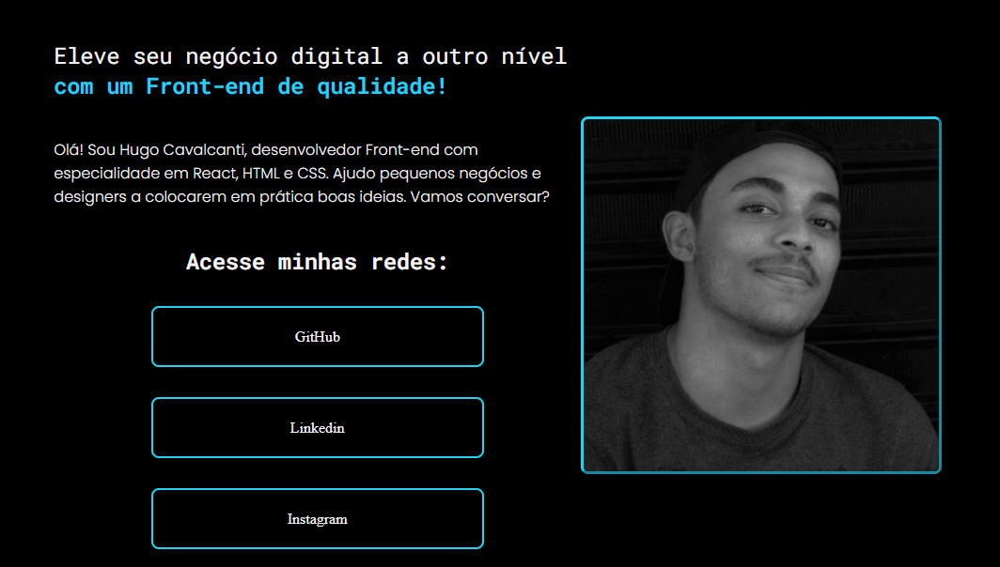

# Responsive portfolio - Hugo Cavalcanti

## Portfolio Screenshot
{}
This is the repository for my personal portfolio, where I share information about my experience and skills as a Front-end developer. This portfolio was built using HTML, CSS, and images.

## Overview
My goal is to help devs elevate their digital presence through quality Front-end development. With expertise in React, HTML, and CSS, I am committed to creating engaging, intuitive, and responsive interfaces to enhance the user experience.

## Features
* Concise presentation of services offered
* Integration with my social media profiles
* Modern and professional design
* Responsiveness across different devices
* Utilization of popular Front-end technologies

## Demo
To see my portfolio in action, visit here.

## Installation
1. Clone this repository to your local machine.
2. Open the index.html file in your web browser.

Copy code
git clone https://github.com/hugo-cavalcanti/responsive-portifolio-hugo

## Contribution
Contributions are welcome! Feel free to make suggestions, report issues, or submit pull requests to improve this project. Together, we can enhance and expand this portfolio.

## Contact
* GitHub: github.com/hugo-cavalcanti
* LinkedIn: linkedin.com/in/hugo-cavalcanti
* Instagram: instagram.com/hugocavcanti